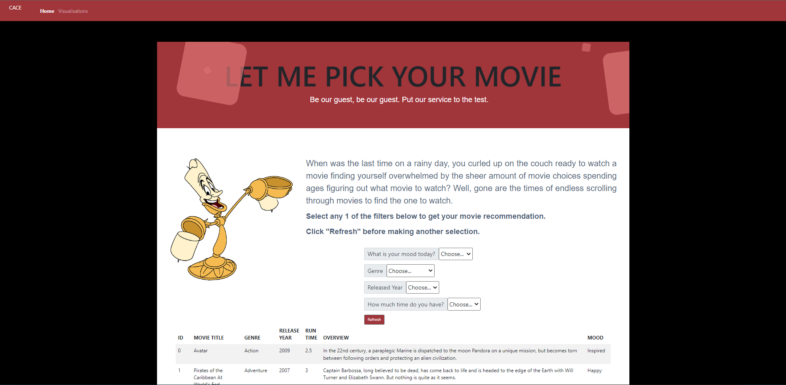
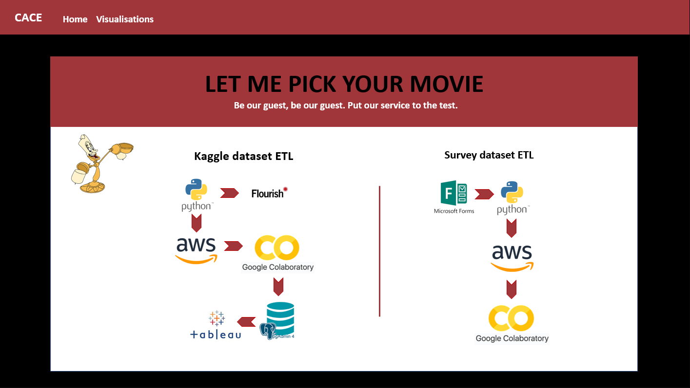
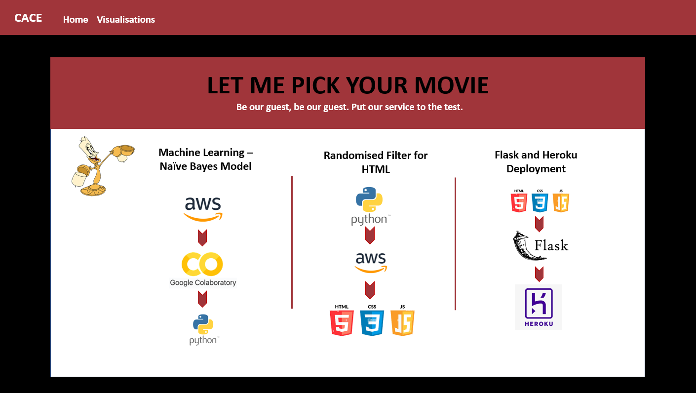
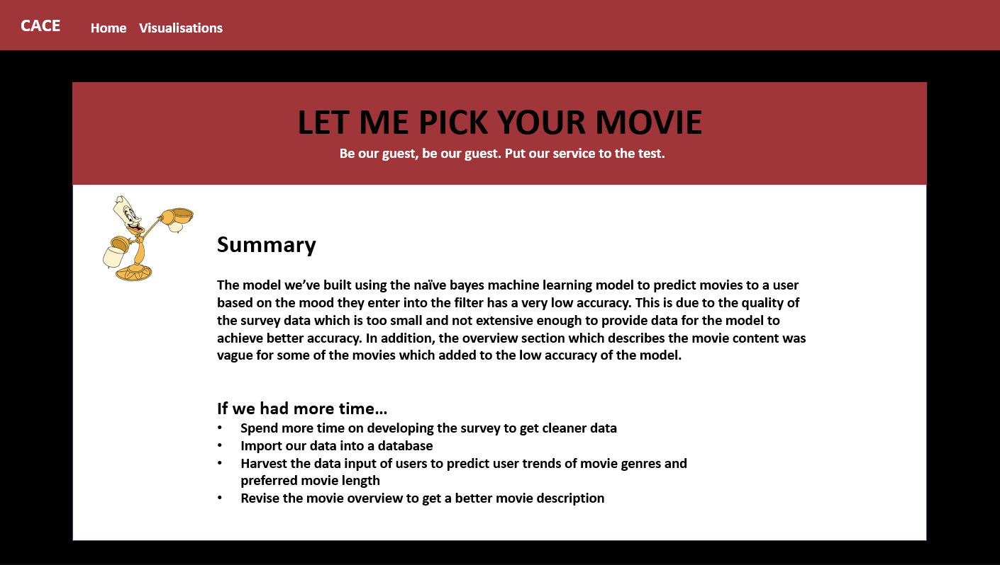

# Final Project - Movie_Pick

## Team member: 
Camille Evangelista, Aline Hornoff, Edbert Widjaja, Carmen Sin

## Scope of the project
When was the last time on a rainy day, you curled up on the couch ready to watch a movie finding yourself overwhelmed by the sheer amount of movie choices spending ages figuring out what movie to watch? 

Well, gone are the times of endless scrolling through movies to find the one to watch. 
Enter your mood, the movie genre, release year of the movie or the time you have available to watch the movie in the interactive dashboard and it will give you a top 5 movie recommendation.

Link to Movie Pick website: https://movie-pick-uwa-project.herokuapp.com/

## Datatset: 
* Movies datasets from kaggle: https://www.kaggle.com/code/omarkhaledabdelraouf/tmdb-5000-movie-dataset-analysis
* Survey created to collect data on mood linked to movie titles for machine learning

  
## Technology applied in this project: 
* Python Pandas
* HTML / CSS / Bootstrap / Flask / Sqlite
* Tableau
* Amazon AWS
* pgAdmin
* Google Colab
* Machine Learning - Naive Bayes model
* Heroku

## Content
1. User interactive dashboard - User input their critieria: users mood, genre and movie length
2. Tableau visualisation - Top 10 movies by revenue, Production Compnay Revenue over 100 years, Scatter Movie Length vs Revenue

## Project Steps:

## Summary

